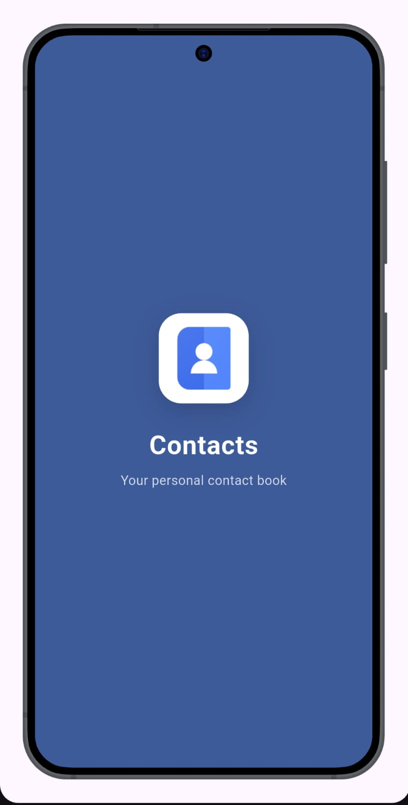
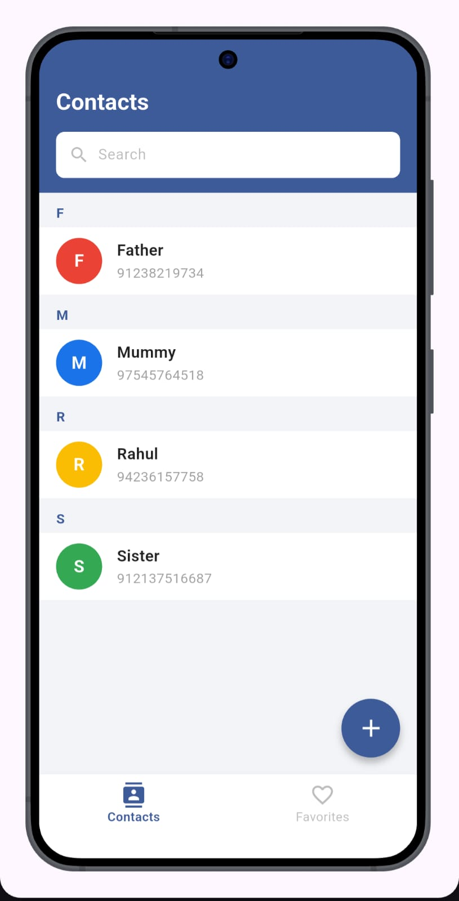
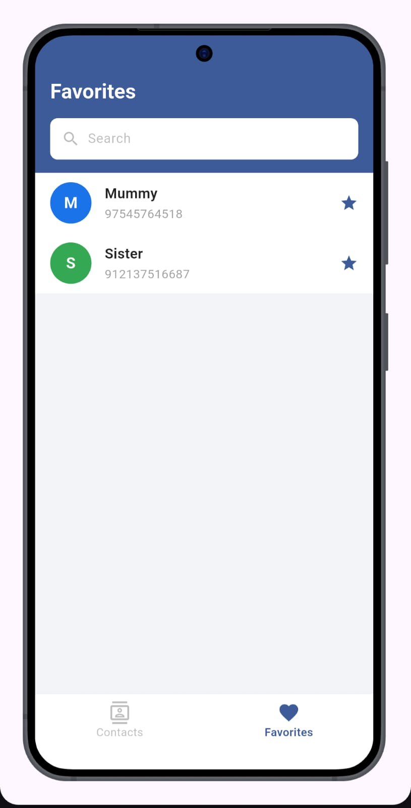
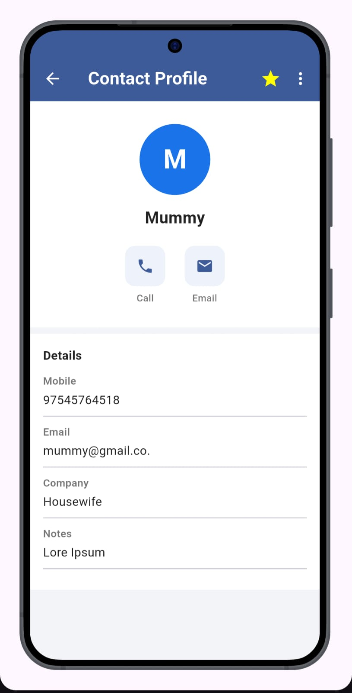
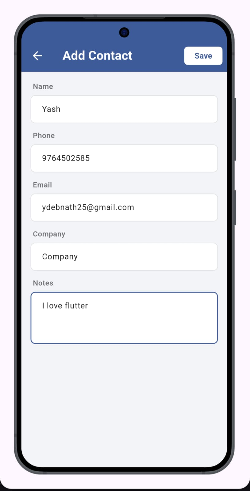
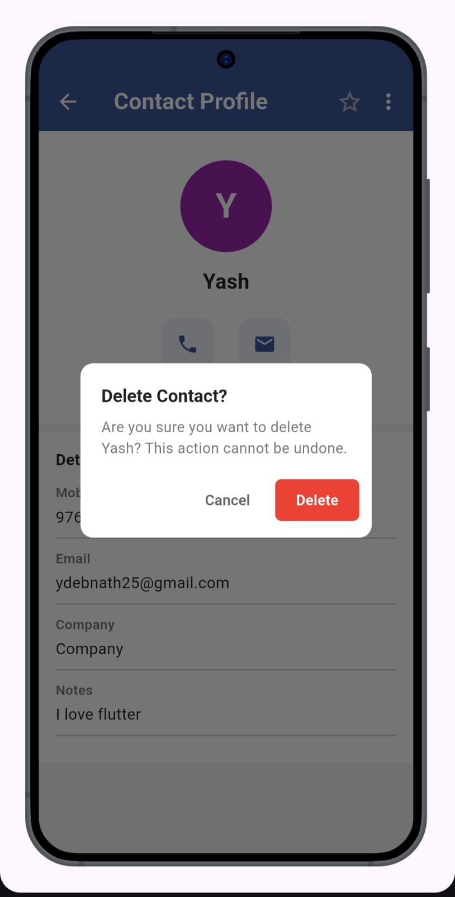

# 📱 Contacts App — Flutter Assignment

A **Google Contacts-inspired** mobile application built with **Flutter**, following a clean **MVC architecture** with **Provider** for state management and **SQLite** for fully offline local storage.

---

## ✨ Features

| Feature | Details |
|---|---|
| **View Contacts** | Alphabetically grouped list with A–Z section headers |
| **Add Contact** | Form with name, phone, email, company, address & notes |
| **Edit Contact** | Pre-filled form; update any field |
| **Delete Contact** | Confirmation dialog before permanent deletion |
| **Contact Profile** | Detail screen with Call / Message / Video actions |
| **Call Contact** | One-tap call via system dialer (`tel:` URL scheme) |
| **Favorite Contacts** | Star/unstar; dedicated Favorites tab |
| **Search Contacts** | Real-time search by name, phone, or email — works on both tabs |
| **Duplicate Detection** | Blocks saving if same name + phone already exists |
| **Splash Screen** | Animated branded launch screen |

---

# 🏗️ Architecture — MVC + Provider

This project strictly separates concerns across three layers:

```
┌─────────────────────────────────────────────┐
│                   VIEW                       │
│  Screens & Widgets (Flutter UI only)        │
│  context.watch / context.read               │
└───────────────────┬─────────────────────────┘
                    │ delegates to
┌───────────────────▼─────────────────────────┐
│               PROVIDER                       │
│  ContactProvider (ChangeNotifier)            │
│  Owns all UI state, notifies widgets         │
└───────────────────┬─────────────────────────┘
                    │ calls
┌───────────────────▼─────────────────────────┐
│              CONTROLLER                      │
│  ContactController (pure Dart, no Flutter)   │
│  Business logic, grouping, duplicate checks  │
└───────────────────┬─────────────────────────┘
                    │ reads/writes
┌───────────────────▼─────────────────────────┐
│               DATABASE                       │
│  DatabaseHelper (SQLite singleton)           │
│  All raw SQL lives here                      │
└─────────────────────────────────────────────┘
```

---

# 📁 Project Structure

```
contacts_app/
├── android/
│   └── app/src/main/AndroidManifest.xml
├── lib/
│   ├── main.dart
│   ├── models/
│   │   └── contact_model.dart
│   ├── controllers/
│   │   └── contact_controller.dart
│   ├── providers/
│   │   └── contact_provider.dart
│   ├── views/
│   │   ├── screens/
│   │   │   ├── splash_screen.dart
│   │   │   ├── home_screen.dart
│   │   │   ├── contacts_tab.dart
│   │   │   ├── favorites_tab.dart
│   │   │   ├── contact_detail_screen.dart
│   │   │   └── add_edit_contact_screen.dart
│   │   └── widgets/
│   │       ├── contact_avatar.dart
│   │       ├── contact_list_tile.dart
│   │       └── confirm_dialog.dart
│   └── utils/
│       ├── app_theme.dart
│       └── database_helper.dart
├── pubspec.yaml
└── README.md
```

---

# 🛠️ Tech Stack

| Package | Version | Purpose |
|---|---|---|
| `provider` | ^6.1.1 | State management |
| `sqflite` | ^2.3.2 | SQLite local database |
| `path` | ^1.9.0 | DB file path resolution |
| `url_launcher` | ^6.2.5 | Phone & email intents |
| `permission_handler` | ^11.3.0 | Runtime phone permission |

---

# 🗄️ Database Schema

```sql
CREATE TABLE contacts (
  id           INTEGER PRIMARY KEY AUTOINCREMENT,
  name         TEXT    NOT NULL,
  phone        TEXT    NOT NULL,
  email        TEXT,
  address      TEXT,
  company      TEXT,
  notes        TEXT,
  is_favorite  INTEGER NOT NULL DEFAULT 0,
  avatar_color TEXT
);
```

Duplicate detection query:

```sql
SELECT id FROM contacts
WHERE name = ? AND phone = ? AND id != ?
LIMIT 1;
```

---

# 🚀 Installation & Setup

### Prerequisites

- Flutter SDK ≥ 3.0
- Android Studio or VS Code
- Android Emulator or Device

### Steps

```bash
git clone https://github.com/dyash2/contacts_app.git
cd contacts_app

flutter pub get

flutter run
```

Build APK:

```bash
flutter build apk --release
```

Output:

```
build/app/outputs/flutter-apk/app-release.apk
```

---

# 📥 Download APK

<p align="center">
  <a href="https://github.com/dyash2/contacts_app/releases/download/v1.0.0/app-release.apk">
    
  </a>
</p>

Direct link:

```
https://github.com/dyash2/contacts_app/releases/download/v1.0.0/app-release.apk
```

---

# 📸 Screenshots

| Splash | Contacts | Favorites | Profile | Add Contact | Delete Dialog |
|---|---|---|---|---|---|
|  |  |  |  |  |  |

---

# 🎥 App Demo

https://github.com/user-attachments/assets/ce9c739e-3c85-4e0a-b545-b789825f6f3e

---

# 👨‍💻 Author

**Yash Debnath**

Flutter Developer
